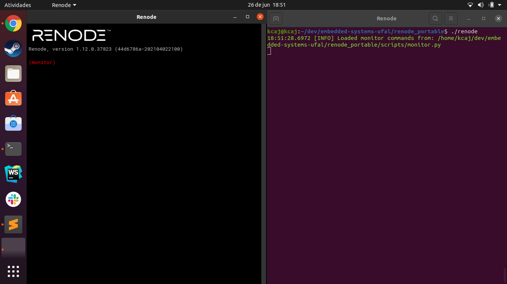
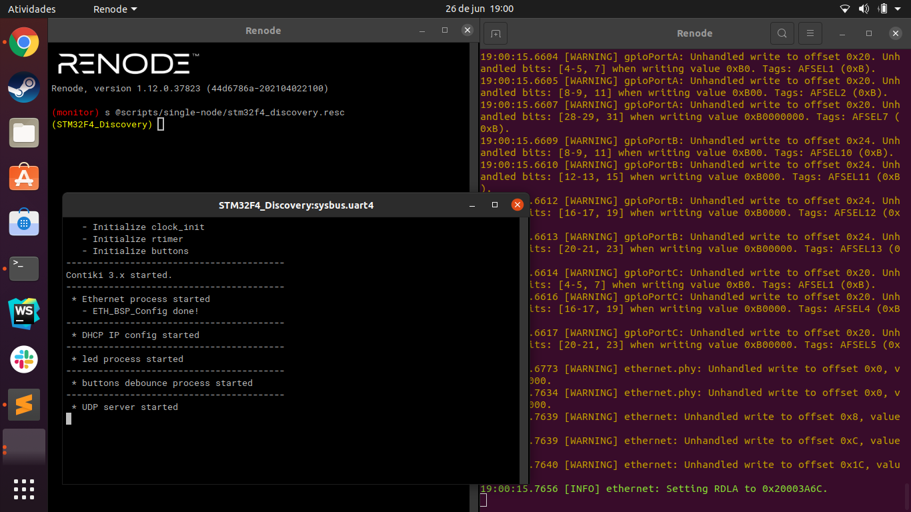

# Install on ubuntu 20.04.2 LTS
The install follow the steps of the readme of [oficial repositore](https://github.com/renode/renode/blob/master/README.rst#installation)
> open terminal (CTRL + ALT + T)

> move to folder with `install-renode.sh` file and run the command `sudo ./install-renode.sh`
# run renode
> move to folder `renode_portable` after the install

> run the command `./renode [flag](optional) [file](optional)`

# run first example 
[read more](https://renode.readthedocs.io/en/latest/introduction/demo.html) about it.

  1. run renode as seen before
  2. on the renode terminal copy the command: s @scripts/single-node/stm32f4_discovery.resc
